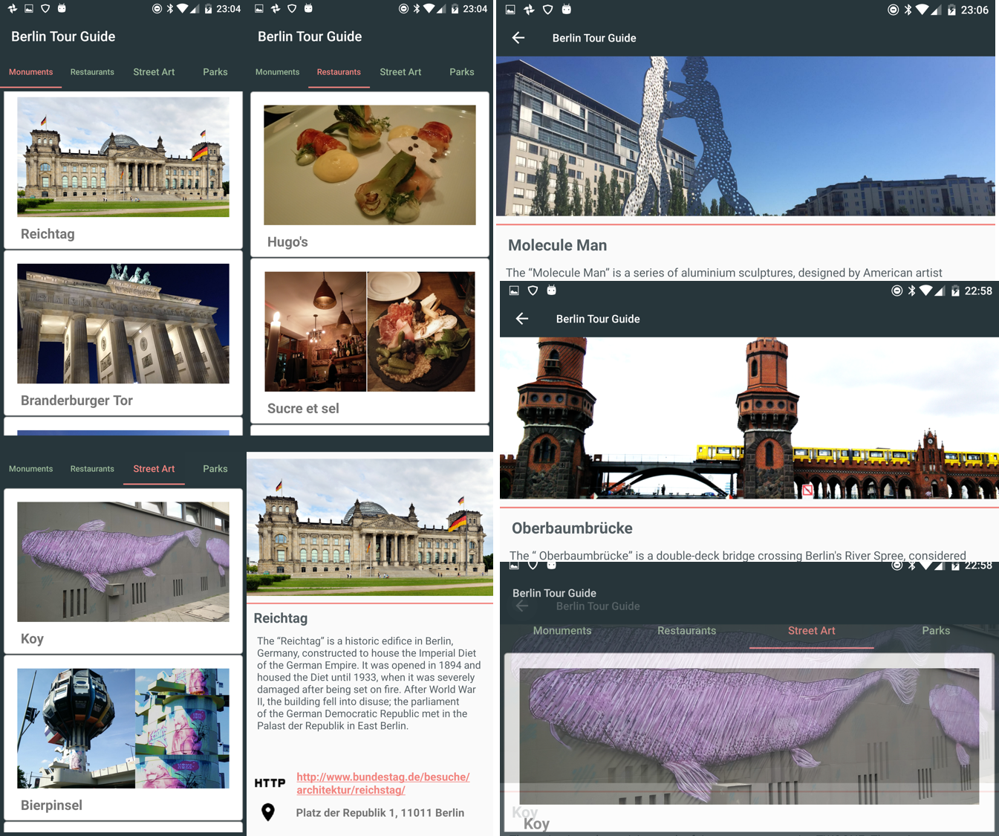

# Tour Guide App

This is the Tour Guide App for Udacity Android basics challenge, which is my fifth project.

The App as the name described is a Guide Tour for BERLIN, Germany.

**About the application**

This App has differents screens and views. It includes 4 lists of relevant attrattions for Berlin:
Monuments, Restaurants, Street Art and Parks.

The activities structure is the following:

* The information of each Location is stored on a custom class (Location)
* The "data base" I created is just an ArrayList of this custom class.
* The main screen has 4 lists (Monuments, Restaurants, Street Art and Parks)
* Users can navigate between the lists (Fragments), becauese I am using a ViewPager plus a TabLayout.
* All the views include pictures from Berlin's location (from my personal photos and free resources).
* The application is valid both in vertical and horizontal.

In total the application has four Fragments related to the categories previously mentioned,
and two activities that correspon to the main view (with the viewPager) and another one
to display the information of the selected location.

**Extra things that I learned/used**

* I included an Intent to open the address from all the locations in Google Maps.
* The TextView that displays the URL, uses the autoLink option, so it is also clickable and will open web on a browser.

